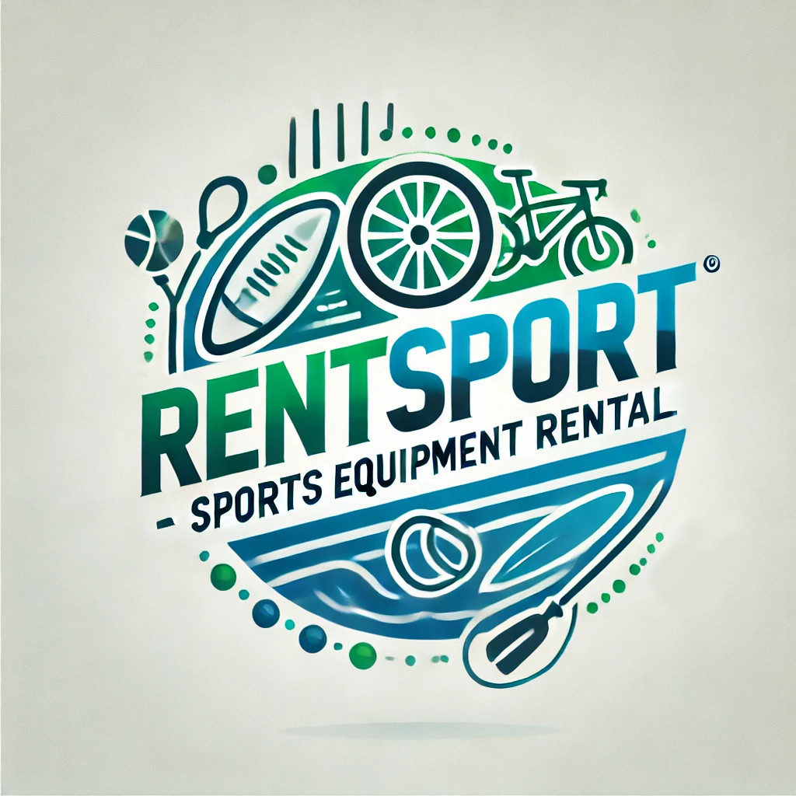

# 1. Idea de la aplicación
Se trata de una aplicación web para el alquiler de equipos deportivos. Los usuarios podrán alquilar equipos como bicicletas, redes de voleibol, equipos de escalada y tablas de surf. Excepto artículos de uso personal como ropa deportiva y calzado, para evitar problemas de seguridad e higiene. La plataforma estará disponible tanto para tiendas como para particulares.

# 2. Audiencia objetiva
La aplicación está dirigida a dos tipos de usuarios:
- Personas que tienen material deportivo guardado que no usan, pero no quieren vender. Podrán generar ingresos alquilando estos equipos.
- Personas interesadas en probar un deporte nuevo o practicarlo temporalmente, sin tener que comprar equipos caros o que usarían en temporadas puntuales.

La plataforma fomenta un consumo responsable, al ofrecer a los usuarios disfrutar de deportes sin la necesidad de realizar grandes inversiones.

# 3. Análisis de mercado
Existen varias plataformas dedicadas al alquiler de equipos deportivos, algunas son:
- **myur!:** Es una aplicación de alquiler entre particulares y profesionales. Ofrece desde herramientas hasta equipos deportivos.
- **Decathlon Rental:** Permite alquilar los equipos directamente desde las tiendas Decathlon.
- **Anches Sports:** Ofrece el alquiler de material deportivo, centrado sobre todo en eventos de actividades al aire libre.

Características comunes con otras aplicaciones similares:
- Reservar equipos a través del sitio web o una aplicación móvil.
- Pagos en línea seguros
- Sistemas de autenticación y gestión de usuarios.

Oportunidades de diferenciación:
- A diferencia de muchas aplicaciones similares que se enfocan en negocios o profesionales, RentSports permite que particulares también alquilen sus equipos facilitando el acceso a una mayor variedad de productos y precios.
- Busca fomentar una comunidad donde los usuarios no solo alquilan equipos, sino que también compartan experiencias, recomendaciones y consejos.
- RentSports promueve un consumo sostenible, permite que los usuarios puedan alquilar equipos que necesitan sin tener que comprar materiales caros.

# 4. Funcionalidades clave
- Sistema de autenticación y creación de usuarios
- Los usuarios podrán buscar por ubicación, tipo de deporte, precios, disponibilidad y calificación del proveedor.
- Los usuarios podrán dejar reseñas y calificaciones sobre su experiencia.
- Sistema de mensajería para que los usuarios puedan conocer más detalles sobre los equipos y organizar los detalles de la entrega.
- Sistema de reservas y pagos en línea.
- La posibilidad de organizar eventos deportivos locales.

